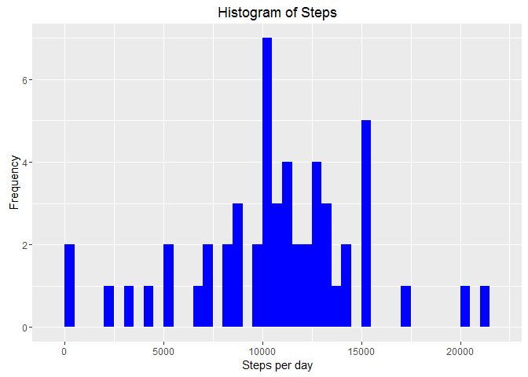

# Reproducible Research: Peer Assessment 1
Antonio Smeby Torres  


## Loading and preprocessing the data

### Loading the packages

For this assignment we will need the "knitr", "dplyr", "lubridate" and "ggplot2" packages:


```r
library(knitr)
```

```r
library(dplyr)
```

```
## Warning: package 'dplyr' was built under R version 3.2.3
```

```
## 
## Attaching package: 'dplyr'
```

```
## The following objects are masked from 'package:stats':
## 
##     filter, lag
```

```
## The following objects are masked from 'package:base':
## 
##     intersect, setdiff, setequal, union
```

```r
library(lubridate)
```

```
## Warning: package 'lubridate' was built under R version 3.2.3
```

```r
library(ggplot2)
```

```
## Warning: package 'ggplot2' was built under R version 3.2.3
```

### Just so we know what's going on

In order for others to see our code we need to set `echo = TRUE` so that our code chunks won't be hidden:


```r
opts_chunk$set(echo = TRUE)
```

### Reading and tidying the data

Assuming we have already downloaded the [activy.cvs](https://d396qusza40orc.cloudfront.net/repdata%2Fdata%2Factivity.zip) file, unzipped it and saved it to our local directory, we read the file as a data frame with:


```r
data <- as.data.frame(read.csv("activity.csv"))
```

We now have a data frame that corresponds to the *"activity.csv"* file called **data**.

Next, we need to change our date into *dateformat* using the `lubridate` package so that we can use this infromation later on:


```r
data$date <- mdy(data$date)
```

### Check to make sure

Now our data should be all set for us to find out what we need. You can check to see if it is using the *str()* and the *head()* commands:


```r
str(data)
```

```
## 'data.frame':	17568 obs. of  3 variables:
##  $ steps   : int  NA NA NA NA NA NA NA NA NA NA ...
##  $ date    : POSIXct, format: "2012-10-01" "2012-10-01" ...
##  $ interval: int  0 5 10 15 20 25 30 35 40 45 ...
```

```r
head(data)
```

```
##   steps       date interval
## 1    NA 2012-10-01        0
## 2    NA 2012-10-01        5
## 3    NA 2012-10-01       10
## 4    NA 2012-10-01       15
## 5    NA 2012-10-01       20
## 6    NA 2012-10-01       25
```

**Now** we are ready to begin.


## What is mean total number of steps taken per day?

#### 1. Calculate the total number of steps taken per day

We are going to use many of the `dplyr` package functions for this assignment, and here is our first example. Using the *"pipe"* operator, we filter the steps column to return the rows that aren't missing values, group them by date and summarize all the steps values to a single value using the *sum()* function:


```r
steps <- data %>%
    filter(!is.na(steps)) %>%
    group_by(date) %>%
    summarize(steps = sum(steps)) %>%
    print(steps)
```

```
## Source: local data frame [53 x 2]
## 
##          date steps
##        (time) (int)
## 1  2012-10-02   126
## 2  2012-10-03 11352
## 3  2012-10-04 12116
## 4  2012-10-05 13294
## 5  2012-10-06 15420
## 6  2012-10-07 11015
## 7  2012-10-09 12811
## 8  2012-10-10  9900
## 9  2012-10-11 10304
## 10 2012-10-12 17382
## ..        ...   ...
```

#### 2. Make a histogram of the total number of steps taken each day

With what we did above we can make the histogram with the aproriate x and y axis using the `gglopt2` package:


```r
ggplot(steps, aes(x = steps)) +
    geom_histogram(fill = "blue", binwidth = 500) +
    labs(title = "Histogram of Steps", 
         x = "Steps per day", 
         y = "Frequency")
```



#### 3. Calculate and report the mean and median total number of steps taken per day

To calculate the mean:


```r
mean_steps <- mean(steps$steps, na.rm = TRUE)
mean_steps
```

```
## [1] 10766.19
```

To calculate the median:


```r
median_steps <- median(steps$steps, na.rm = TRUE)
median_steps
```

```
## [1] 10765
```

So we find that the mean number of steps is 10766.19 and the median is 10765.


## What is the average daily activity pattern?

#### 1. Make a time series plot of the 5-minute interval (x-axis) and the average number of steps taken, averaged across all days (y-axis)

This is similar to the first question, however, instead of grouping by date, we group by interval and instead of summarizing the steps of each interval by adding them, we calculate their mean.

Once again, `dplyr` comes in very handy:


```r
interval <- data %>%
    filter(!is.na(steps)) %>%
    group_by(interval) %>%
    summarize(steps = mean(steps))
    interval
```

```
## Source: local data frame [288 x 2]
## 
##    interval     steps
##       (int)     (dbl)
## 1         0 1.7169811
## 2         5 0.3396226
## 3        10 0.1320755
## 4        15 0.1509434
## 5        20 0.0754717
## 6        25 2.0943396
## 7        30 0.5283019
## 8        35 0.8679245
## 9        40 0.0000000
## 10       45 1.4716981
## ..      ...       ...
```

We now have our x and y axis, so we can plot our graph:


```r
ggplot(interval, aes(x=interval, y=steps)) +
    geom_line(color = "blue") +
    labs(title = "Time Series Plot of Steps per Interval",
         x = "Interval",
         y = "Average Number of Steps")
```


#### 2. Which 5-minute interval, on average across all the days in the dataset, contains the maximum number of steps?

All we have to do here is subset the interval with the maximum number of steps:


```r
interval[which.max(interval$steps),]
```

```
## Source: local data frame [1 x 2]
## 
##   interval    steps
##      (int)    (dbl)
## 1      835 206.1698
```

And we can se that interval 835 has the highest average number of steps (206.1698).


## Imputing missing values

#### 1. Calculate and report the total number of missing values in the dataset (i.e. the total number of rows with NAs)

For this we simply need to add the number of rows in which there are missing values for the *steps* variable:


```r
sum(is.na(data$steps))
```

```
## [1] 2304
```

There are 2304 instances where there is no value for the *steps* variable.


#### 2. Devise a strategy for filling in all of the missing values in the dataset

We are going to fill in the missing `NA` values with the average number of steps that are taken in the same 5-min interval.

#### 3. Create a new dataset that is equal to the original dataset but with the missing data filled in

First we need to create a new data frame that is equal to the original:


```r
data_full <- data
```

Find the missing vales in our new data frame:


```r
NAS <- is.na(data_full$steps)
```

Figure out what the avarege is for a particular interval. We can do this using the *tapply()* function by calculating the mean number of steps in each interval with the *simplify* argument set to *TRUE* so that *tapply()* returns a scalar:


```r
avg_interval <- tapply(data_full$steps, data_full$interval, mean, na.rm=TRUE, simplify=TRUE)
```

Fill in the missing values with that average:


```r
data_full$steps[NAS] <- avg_interval[as.character(data_full$interval[NAS])]
```

And check for missing values in our new data frame to see if everything went according to plan:


```r
sum(is.na(data_full$steps))
```

```
## [1] 0
```

And we see that it did.

#### 4. Make a histogram of the total number of steps taken each day and Calculate and report the mean and median total number of steps taken per day

As before, we calculate the total number of steps taken per day according to our new data frame:


```r
steps_full <- data_full %>%
    filter(!is.na(steps)) %>%
    group_by(date) %>%
    summarize(steps = sum(steps)) %>%
    print
```

```
## Source: local data frame [61 x 2]
## 
##          date    steps
##        (time)    (dbl)
## 1  2012-10-01 10766.19
## 2  2012-10-02   126.00
## 3  2012-10-03 11352.00
## 4  2012-10-04 12116.00
## 5  2012-10-05 13294.00
## 6  2012-10-06 15420.00
## 7  2012-10-07 11015.00
## 8  2012-10-08 10766.19
## 9  2012-10-09 12811.00
## 10 2012-10-10  9900.00
## ..        ...      ...
```

And with that infromation we can create a new histogram:

```r
ggplot(steps_full, aes(x = steps)) +
    geom_histogram(fill = "blue", binwidth = 500) +
    labs(title = "Histogram of Steps per day, including missing values", 
         x = "Steps per day", 
         y = "Frequency")
```


We calculate the mean number of steps in the complete data frame:

```r
mean_steps_full <- mean(steps_full$steps, na.rm = TRUE)
mean_steps_full
```

```
## [1] 10766.19
```

And the median: 

```r
median_steps_full <- median(steps_full$steps, na.rm = TRUE)
median_steps_full
```

```
## [1] 10766.19
```

#### 5. Do these values differ from the estimates from the first part of the assignment? 
Compairing the results from the complete data frame (mean = 10766.19, median = 10766.19) with those of the original (mean = 10766.19, median = 10765), we can se that there is only a slight difference in the medians (1.19 higher in the new data frame).

#### 6. What is the impact of imputing missing data on the estimates of the total daily number of steps?
We alter the median in a way that makes it the same as the mean (at least in this case), which is the same as the mean we got from the original data frame (10766.19).


## Are there differences in activity patterns between weekdays and weekends?

#### 1. Create a new factor variable in the dataset with two levels -- "weekday" and "weekend" indicating whether a given date is a weekday or weekend day

We can do this with the *mutate()* function from the `dplyr` package, which executes transformations that later transformations can use. With the *mutate()* function we create a new variable called **weektype** with the levels *"weekday"* and *"weekend"*, which tells us what type of day of the week it is:


```r
data_full <- mutate(data_full, weektype = ifelse(weekdays(data_full$date) == "Saturday" | weekdays(data_full$date) == "Sunday", "weekend", "weekday"))
data_full$weektype <- as.factor(data_full$weektype)
```


#### 2. Make a panel plot containing a time series plot of the 5-minute interval (x-axis) and the average number of steps taken, averaged across all weekday days or weekend days (y-axis)

Since in the previous step we found the dates that correspond to weekdays and weekends, all we have to do now is separate the means of the weekday intervals from the weekend intervals:


```r
interval_full <- data_full %>%
    group_by(interval, weektype) %>%
    summarise(steps = mean(steps))
```

And now that we have found the mean number of steps taken during weekdays and weekends, we can create our panel plot with the `ggplot2` package:


```r
ggplot(interval_full, aes(x=interval, y=steps, color = weektype)) +
    geom_line() + facet_wrap(~weektype, ncol = 1, nrow = 2)
```


From the two plots we can see that during weekdays this person seems to move more earlier in the day than during weekends, however, during the weekends the steps are spread more evenly throughout the day.
